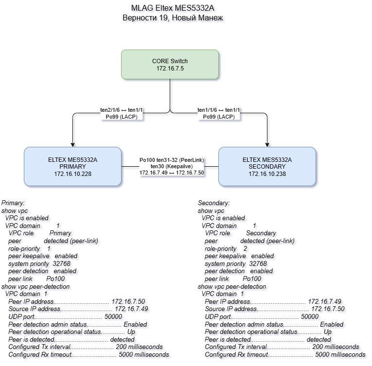

# Построение отказоустойчивой L2-сети MLAG/VPC на Eltex MES5322A

## Описание проекта

Проект выполнен в рамках курса **Network Base**. Цель работы — построить отказоустойчивый L2-уровень распределения на двух коммутаторах **Eltex MES5322A** с использованием технологии **MLAG/VPC**.

Решение позволяет подключать uplink/downlink-соединения к двум физическим коммутаторам как к одному логическому узлу. За счёт этого повышается отказоустойчивость сети и уменьшается зависимость от STP-блокировок.

## Топология



### Основная идея схемы

- два коммутатора Eltex MES5322A работают в одном **VPC domain 1**;
- один коммутатор выполняет роль **PRIMARY**, второй — **SECONDARY**;
- между коммутаторами настроен **peer-link** через `Port-Channel100`;
- для контроля доступности peer-устройства используется отдельный **keepalive / peer-detection** линк;
- uplink к ядру и downlink-соединения вынесены в `Port-Channel` и подключаются как VPC-порты;
- пользовательские, сервисные, Wi-Fi и управляющие VLAN передаются по trunk-каналам.

## Адресация и роли устройств

| Устройство | Роль | Management IP | Keepalive IP | Приоритет роли |
|---|---:|---:|---:|---:|
| `vernosty19-level2-distr-prim` | PRIMARY | `172.16.10.228/24` | `172.16.7.49/30` | `1` |
| `vernosty19-level2-distr-sec` | SECONDARY | `172.16.10.238/24` | `172.16.7.50/30` | `2` |
| `CORE Switch` | ядро сети | `172.16.7.5` | — | — |

Шлюз управления для обоих коммутаторов:

```text
ip default-gateway 172.16.10.1
```

## Используемые технологии

| Технология | Назначение в проекте |
|---|---|
| **MLAG / VPC** | отказоустойчивое L2-подключение к двум коммутаторам как к одному логическому узлу |
| **LACP / Port-Channel** | агрегация физических линков в логические каналы |
| **Peer-link** | синхронизация MLAG/VPC-состояния между PRIMARY и SECONDARY |
| **Peer keepalive / peer detection** | контроль доступности соседнего MLAG-коммутатора |
| **802.1Q trunk** | передача нескольких VLAN по одному логическому каналу |
| **VLAN** | логическая сегментация пользователей, Wi-Fi, телефонии, принтеров, ASUTP и management-сети |
| **Loopback Detection** | защита от L2-петель на уровне коммутатора |
| **SNMPv3** | мониторинг оборудования |
| **Syslog** | централизованный сбор логов |
| **RADIUS AAA** | централизованная аутентификация администраторов |
| **SNTP** | синхронизация времени |
| **SSH** | безопасный удалённый доступ к CLI |

## Таблица VLAN

| VLAN | Название | Назначение |
|---:|---|---|
| 60 | `MGMT` | управление оборудованием |
| 80 | `vWLC-WiFi` | Wi-Fi / WLC |
| 90 | `WiFi_Eltex` | Wi-Fi Eltex |
| 109 | `Users_Vernosty21` | пользователи Верности 21 |
| 110 | `videodev` | видеоустройства |
| 120 | `Users_Vernosty19` | пользователи Верности 19 |
| 130 | `Phone_Asterisk` | IP-телефония |
| 140 | `Printers` | принтеры |
| 150 | `Guest_WiFi` | гостевой Wi-Fi |
| 160 | `Users_WiFi` | пользовательский Wi-Fi |
| 170 | `TV_Pristavki` | ТВ-приставки |
| 215 | `PXE-ASTER` | PXE / Asterisk |
| 300 | `CompClass` | компьютерный класс |
| 310 | `Paragraf` | школьная подсеть / сервис |
| 320 | `SchoolInet` | школьный интернет |
| 888 | `Scool_Internet_inboundChannel` | входящий интернет-канал школы |
| 900 | `Press_WiFi` | Wi-Fi для прессы |
| 911 | `ASUTP` | АСУ ТП |

## Логическая схема Port-Channel

| Port-Channel | Назначение | VLAN |
|---:|---|---|
| `Po99` | uplink к `Vernosty21-gzh-core` | `60,80,90,109-110,120,130,140,150,160,170,215,900,911` |
| `Po100` | MLAG/VPC peer-link | `60,80,90,109-110,120,130,140,150,160,170,215,300,310,320,888,900,911` |
| `Po3` | downlink `vernosty19-level2-sw-01_172.16.10.229` | `60,90,109,120,130,140,150,160,170,900,911` |
| `Po4` | downlink `sw-02-stack_10.230` | `60,90,120,130,140,150,160,170,300,310,320,888,900,911` |
| `Po5` | downlink `vernosty19-level3-sw-01-stack` | `60,80,90,120,130,140,150,160,170,300,310,320,900,911` |
| `Po6` | downlink `balcony` | `60,90,109,120,130,140,150,160,170,900,911` |
| `Po7` | downlink `field` | `60,90,110,120,130,140,150,160,170,900,911` |
| `Po8` | downlink `school` | `60,120,130,300,310,320,888` |
| `Po9` | downlink `level3-sw-02-stack04_10.235` | `60,80,90,120,130,140,150,160,170,215,900,911` |
| `Po10` | downlink `NW-gate_10.237` | `60,90,109,120,130,140,150,160,900,911` |

## Конфигурация MLAG/VPC

### PRIMARY

```text
hostname vernosty19-level2-distr-prim

vpc
vpc domain 1
 peer detection
 peer detection interval 200
 peer detection ipaddr 172.16.7.50 172.16.7.49
 peer keepalive
 role priority 1
 peer link port-channel 100
exit
```

### SECONDARY

```text
hostname vernosty19-level2-distr-sec

vpc
vpc domain 1
 peer detection
 peer detection interval 200
 peer detection ipaddr 172.16.7.49 172.16.7.50
 peer keepalive
 role priority 2
 peer link port-channel 100
exit
```

## Настройка peer-link

Peer-link построен на `Port-Channel100`, куда входят два физических 10G-интерфейса:

```text
interface TenGigabitEthernet1/0/31
 description peerlink
 channel-group 100 mode auto
exit

interface TenGigabitEthernet1/0/32
 description peerlink
 channel-group 100 mode auto
exit

interface Port-Channel100
 speed 10000
 description peerlink
 switchport mode trunk
 switchport trunk allowed vlan add 60,80,90,109-110,120,130,140,150
 switchport trunk allowed vlan add 160,170,215,300,310,320,888,900,911
exit
```

## Настройка keepalive / peer detection

Для peer-detection используется отдельный routed-интерфейс `Te1/0/30`.

### PRIMARY

```text
interface TenGigabitEthernet1/0/30
 description keepalive
 ip address 172.16.7.49 255.255.255.252
exit
```

### SECONDARY

```text
interface TenGigabitEthernet1/0/30
 description keepailve
 ip address 172.16.7.50 255.255.255.252
exit
```

## Настройка VPC-групп

VPC-группы связывают логические Port-Channel с VPC-доменом.

```text
vpc group 1
 domain 1
 vpc-port port-channel 99
exit

vpc group 3
 domain 1
 vpc-port port-channel 3
exit

vpc group 4
 domain 1
 vpc-port port-channel 4
exit

vpc group 5
 domain 1
 vpc-port port-channel 5
exit

vpc group 6
 domain 1
 vpc-port port-channel 6
exit

vpc group 7
 domain 1
 vpc-port port-channel 7
exit

vpc group 8
 domain 1
 vpc-port port-channel 8
exit

vpc group 9
 domain 1
 vpc-port port-channel 9
exit

vpc group 10
 domain 1
 vpc-port port-channel 10
exit
```

> В конфигурации также присутствует `vpc group 2` с `port-channel 101`. Перед размещением в продуктивной документации нужно проверить, используется ли `Po101`, так как в предоставленном фрагменте отдельный `interface Port-Channel101` не описан.

## Настройка uplink к ядру

```text
interface Port-Channel99
 description UpLink_to_Vernosty21-gzh-core
 switchport mode trunk
 switchport trunk allowed vlan add 60,80,90,109-110,120,130,140,150
 switchport trunk allowed vlan add 160,170,215,900,911
exit
```

## Пример downlink-настройки

```text
interface Port-Channel4
 speed 10000
 description DownLink_to_sw-02-stack_10.230
 switchport mode trunk
 switchport trunk allowed vlan add 60,90,120,130,140,150,160,170,300
 switchport trunk allowed vlan add 310,320,888,900,911
 switchport forbidden default-vlan
exit
```

## Сервисные настройки

### Управление и доступ

```text
ip ssh server
no ip telnet server
```

### Syslog

```text
logging host 192.168.92.47 severity debugging
logging origin-id ip
logging source-interface vlan 60
```

### SNTP

```text
clock timezone MSK +3
clock source sntp
sntp unicast client enable
sntp server 10.5.0.181 poll
sntp server 192.168.92.181 poll
sntp server 192.168.93.181 poll
sntp source-interface vlan 60
```

### Loopback Detection

```text
loopback-detection enable
```

## Проверка работы

После настройки нужно проверить:

```text
show vpc
show vpc peer-detection
show running-config interface port-channel 100
show running-config interface port-channel 99
show interfaces port-channel 100
show interfaces status
show vlan
show logging
```

Ожидаемый результат:

- VPC domain включён;
- PRIMARY и SECONDARY определены корректно;
- peer-link находится в состоянии `up`;
- peer keepalive включён;
- peer detection status — `Up`;
- Port-Channel trunk-порты передают нужные VLAN;
- management-доступ работает через VLAN 60.

## Что получилось

В результате выполнена настройка отказоустойчивого L2-уровня распределения:

1. Настроена MLAG/VPC-пара из двух Eltex MES5322A.
2. Разделены роли PRIMARY и SECONDARY.
3. Настроены peer-link и keepalive.
4. Uplink/downlink-соединения собраны в Port-Channel.
5. VLAN передаются по trunk-каналам без использования default VLAN.
6. Добавлены базовые сервисы эксплуатации: SSH, SNMP, Syslog, SNTP, RADIUS.

## Выводы

MLAG/VPC позволяет построить отказоустойчивую L2-инфраструктуру без классических STP-блокировок uplink/downlink-каналов. Такая схема повышает доступность сети, позволяет использовать оба коммутатора одновременно и упрощает подключение downstream-оборудования через Port-Channel.

Главная сложность проекта — необходимость синхронно поддерживать конфигурацию VLAN, Port-Channel и VPC-групп на обоих коммутаторах. При расхождении allowed VLAN или настроек peer-link возможны проблемы с доступностью части L2-сегментов.

## Файлы проекта

```text
.
├── README.md
├── images/
│   └── MLAG5332A.jpg
├── drawio/
│   └── MLAG.drawio
├── configs/
│   ├── vernosty19-level2-distr-prim_sanitized.cfg
│   └── vernosty19-level2-distr-sec_sanitized.cfg
└── presentation/
    └── MLAG_Eltex_MES5322A_VKR.pptx
```

## Безопасность перед публикацией в GitHub

Перед публикацией сетевых конфигураций необходимо удалить или замаскировать все чувствительные данные. В этом проекте конфиги в каталоге `configs/` подготовлены как **sanitized**-версии.

### Что нужно маскировать

| Категория | Пример в конфигурации | Статус в проекте |
|---|---|---|
| Пароли локальных пользователей | `username ... password ...` | заменено на `<REMOVED>` |
| RADIUS shared secrets | `radius-server ... key ...` | заменено на `<REMOVED>` |
| SNMP community strings | `snmp-server community ...` | удалено/замаскировано |
| SNMPv3 auth/priv keys | `snmp-server user ... auth ... priv ...` | удалено/замаскировано |
| Публичные IP продуктивной инфраструктуры | реальные внешние адреса | не публиковать; заменить на `X.X.X.X` или TEST-NET |

### Проверка перед коммитом

Перед `git add` рекомендуется выполнить быстрый поиск по конфигам:

```bash
grep -RniE "password|secret|community|snmp-server user|radius-server.*key|public-ip" configs/
```

В текущей версии проекта все найденные sensitive-строки либо заменены на `<REMOVED>`, либо оставлены только как безопасные служебные строки без секретов. В конфигурациях используются частные адреса RFC1918; если в вашей продуктивной версии есть публичные адреса, их нужно заменить перед публикацией.
